# 1.0 Queensland Government Website Standards

The Queensland Government’s [Information Standard 26 (IS26)](https://www.qgcio.qld.gov.au/products/qgea-documents/548-information/2446-internet-is26) policy states that all public-facing Queensland Government websites must comply with the appropriate website standard.

The standards are:
* Franchise Website Standard (also known as SWE)
* Agency Website Standard (also known as the Consistent User Experience or ‘CUE’).

This page will assist agencies to understand and comply with the Franchise Website Standard.  

## 1.1	The Franchise Website Standard 

The Franchise Website Standard helps agencies contribute to a franchise model for Queensland Government online service delivery. The objective of the model is to make it easier for customers to interact with the Queensland Government by organising all citizen-facing content in a customer-centric rather than agency-centric way. This means that each franchise delivers online content for a specific topic or audience.

All Queensland Government franchise websites need to adhere to a set of guidelines that provide customers with a **single website experience (SWE)**. These guidelines form a template of technical components for use by government departments. 

This document:  
*	outlines the requirements for developing website components 
*	helps departments customise the components for their specific audience. 

The requirements included in this document have been developed in consultation with a wide range of stakeholders (including members of the User Interface Community of Practice) and tested by customer focus groups. 

## 1.2	Where to find help

Should an agency require support and guidance on the use of the Franachise Website Standard, they are encouraged to contact Queensland Online. Such queries could include:

*	Variations to a particular requirement within the Franchise Website Standard
*	Requesting a variation to a CSS element
*	Assistance with the customisation of page modals
*	Access to the GitHub pattern library (note—please create a GitHub account prior to contacting Queensland Online)
*	Joining the User Interface Community of Practice (UI CoP)
*	Google Analytics and SEO advice
*	Access to the Customer Research Lab

# 2.0 Accessibility

The Disability Discrimination Act 1992 (Cwlth) states that all Australian websites must comply with the [W3C Web Content Accessibility Guidelines (WCAG) 2.0](https://www.w3.org). Queensland Government websites and websites established or commissioned by Queensland Government bodies, extranets and internet applications are also specifically mandated in IS26 to achieve conformance Level AA of these guidelines.

Note: Some agencies may require WCAG AAA Level conformance (e.g. Department of Communities, Child Safety and Disability Services). Refer to your agency’s web policy or procedure for guidelines on your conformance requirements. 

WCAG 2.0 also provides specific requirements for Rich Internet Applications. It allows for a baseline technology to be set by the site creator (e.g. JavaScript) but does not remove the responsibility of meeting success criteria (e.g. the JavaScript **must** be made accessible).

Refer to [WAI Rich Internet Applications (WAI-ARIA)](https://www.w3.org/TR/wai-aria-1.1/) for more information.

# 3.0	URL and filename design guidelines

Queensland Government websites must comply with a set of URL design guidelines. These guidelines have been formulated to create ‘clean’ and ‘persistent’ URLs. To comply with these guidelines, an agency should use the following naming conventions for pages, sections or images:

*	Use lower case, no spaces—use hyphens to separate words (e.g. image-name-here.jpg)
*	Name the file so it clearly describes what it is (e.g. ‘red-bus.jpg’, not ‘image-563.jpg’)
*	Use keywords and follow current industry search engine optimisation guidelines
*	For images, organise the file structure based on how it will be used (e.g. consider grouping all thumbnails in a folder called 'thumbs' and name them based on the topic they represent. A feature image from the June 2013 JP mobile app could be grouped and named as follows: images/feature/201306-new-jp-mobile-web-app.jpg). 

Refer to [URL design guidelines](https://www.forgov.qld.gov.au/url-design-guidelines) for more information.

# 4.0	Structure and page types

Government franchise websites will use an information architecture (IA) similar to:

Level | Webpage | Example
--- | ------------- | -------------
Level 0 | Home page | https://www.qld.gov.au/
Level 1 | High-level audience pages | https://www.qld.gov.au/queenslanders
Level 2 | Franchise landing pages | https://www.qld.gov.au/transport
Level 3 | Topic index pages | https://www.qld.gov.au/transport/safety
Level 4	| Content pages | https://www.qld.gov.au/transport/safety/road-safety/driving-safely/drive-safely

Things to note: 
  1.	This structure is provided for illustrative purposes only. Franchise websites can have multiple levels of index pages before attaching a content page. 
  2.	Levels 0 and 1 are controlled by Queensland Online and the Department of the Premier and Cabinet. The ‘look and feel’ and structure of these pages has already been configured based on user feedback and are unable to be modified.
  3.	All other levels can be customised to some degree.

## 4.1	Linked content

In addition to navigational linking above, franchise websites can also link to different sections within the site, to other franchises or externally, to other websites. 

### 4.1.1	Links within the franchise model 

Index pages link to other content pages or other index pages within the same franchise or other franchises (websites within www.qld.gov.au). This is necessary when content is relevant to more than one section of the IA or to more than one franchise audience. 

Ideally, links should use the same teaser text and thumbnail images as those used in the host location. The breadcrumb, section navigation and URL of the linked page should display where it is actually built in the IA. 

### 4.1.2	Links external to franchise websites 

When linking outside of the franchise, always consider the customer journey. It is better to take the customer directly to the content they are looking for rather than duplicating it or creating a page that represents an ‘extra click’ and offers little additional value.

When linking to non-Queensland Government websites give preference to credible and authoritative .gov, .edu and .org websites (e.g. peak industry associations, statutory authorities and other government or government-funded websites). Avoid links to commercial websites as these may appear to convey endorsement or affiliation.

More guidelines on linking can be found in the Queensland Government [Web writing and style guide](https://www.forgov.qld.gov.au/web-writing-and-style-guide).

# 5.0	Responsive and flexible layout

Government franchise websites and online services, must use a responsive design that adjusts the layout of components for mobile devices. All layout, page and content elements must be flexible (have a fluid width) so that at lower resolutions, all 3-column layouts will compact in the correct order into 2 columns and then 1 column, based on CSS media queries.

Please refer to the [SWE 3 Grid System](https://qld-gov-au.github.io/web-template-release/styles.html#grid) for additional information on responsive and flexible layouts.

# 6.0 Corporate identity 

The Queensland Government Single Website Experience must use the same colours, borders, shadings, imagery and/or symbols on all pages to achieve a consistent look and feel. This means that only fonts and colours specified in the approved CSS should be used.

Please refer to the [SWE 3 CSS Styles](https://qld-gov-au.github.io/web-template-release/styles.html) for additional information on the corportate identity.

# 7.0	Page models

To ensure that Queensland Government franchise websites have a consistent functionality and appearance, a set of reusable and standardised components are used to form a templated page model. This section will look at the global components that can be used on multiple pages and will also consider various components required for each specific page type.

## 7.1 Global elements

Some elements are ‘global’ because they appear across all page types (refer to the wireframe below). Other components are ‘global’ in that they can appear across multiple page types. Those elements are referenced in the component table below the wireframe. 

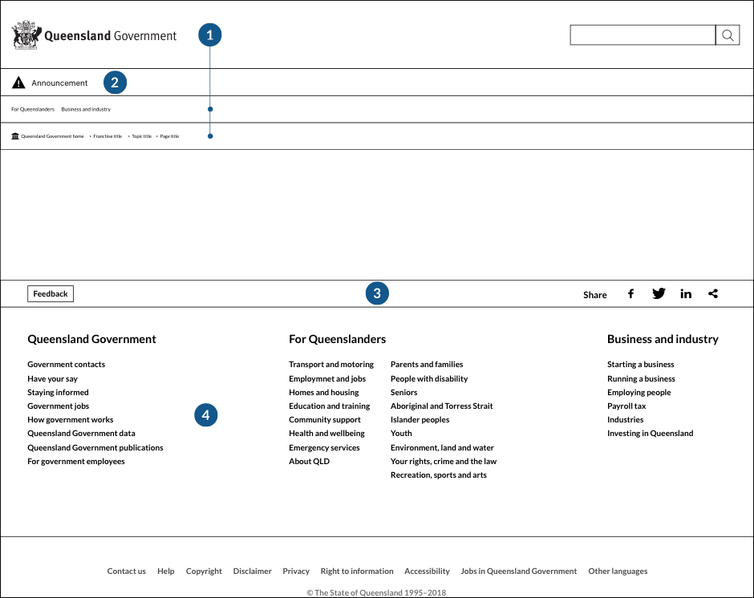

Global elements

Ref | Component | Presence | Location (page types) | Flexibility
--- | ------------- | ------------- | ------------- | -------------
0 | Metadata and access links | Required | All  | None
1 | Header includes the Queensland Government branding/navigation bar and breadcrumb trail | Required | All  | None
2 | Global announcement (will only appear when there is a site-wide announcement such as state-wide disaster or major alert) | Required | All  | None
3 | Page options (includes ‘feedback’ button and page share options) | Optional | All  | Cannot be moved. 4 page options (Facebook, Twitter, LinkedIn and share) will be displayed. An agency can include more icons, if required. 
4 | Fat footer and footer | Required | All  | None

## 7.2	Franchise landing page [Level 2]

The franchise landing page helps customers easily browse and navigate to all content in the section. 
Refer to the global elements section and table below for franchise landing page components.

Franchise landing page [Level 2]

Ref | Component | Presence | Location (page types) | Flexibility
--- | ------------- | ------------- | ------------- | -------------
5 | Page title | Required | All*  | None. * Although each page contains a page title, it can be hidden or appear in different locations
6 | Links to child pages (IA drill-down) will display a maximum of 9 topic or content links. Each of these can then display a maximum of 4 child page (the 5th link will be ‘read more’). | Required | Franchise landing page, topic index. | None. Order of links is based on the needs of the audience.
7 | Promoted content (e.g. initiatives, customer stories, social media or consultations) | Optional |  | Can be moved
8 | Whole-of-government notice aside (e.g. donations or important event) | Required | Can appear on any page with a right-hand panel | None. Markup, presentation and behaviour must be identical.
9 | Contact details aside (‘aside’ content always appears in the right-hand panel). If it is a ‘crisis contact’ aside, a single phone number is presented in a yellow box under the text ‘If you are in crisis, call xxx xxx’. This should be the first contact box on the page. | Required | Franchise landing page (optional on content pages) | None. Markup, presentation and behaviour must be identical.
10 | Aside content (e.g. related initiatives, latest news, upcoming events, contact details, tips, customer stories or case studies). As above, if it is a ‘crisis contact’ refer to component 9. | Optional | Franchise landing page, topic index, standard, guide, service, silent node, news/events index, news content. | Can be moved. Asides with different elements, locations or presentations may be possible (based on customer/business needs) after consultation with Queensland Online. 

## 7.3	Topic index pages [Level 3]

Topic index pages organise and display groups of similarly themed content. They can link in all directions (to sibling, child, or parent pages). 

Note that there can be multiple levels of index pages if the content requires it. There are no specific component requirements for topic index pages. 

Refer to the global elements section for the components in the wireframe below. 

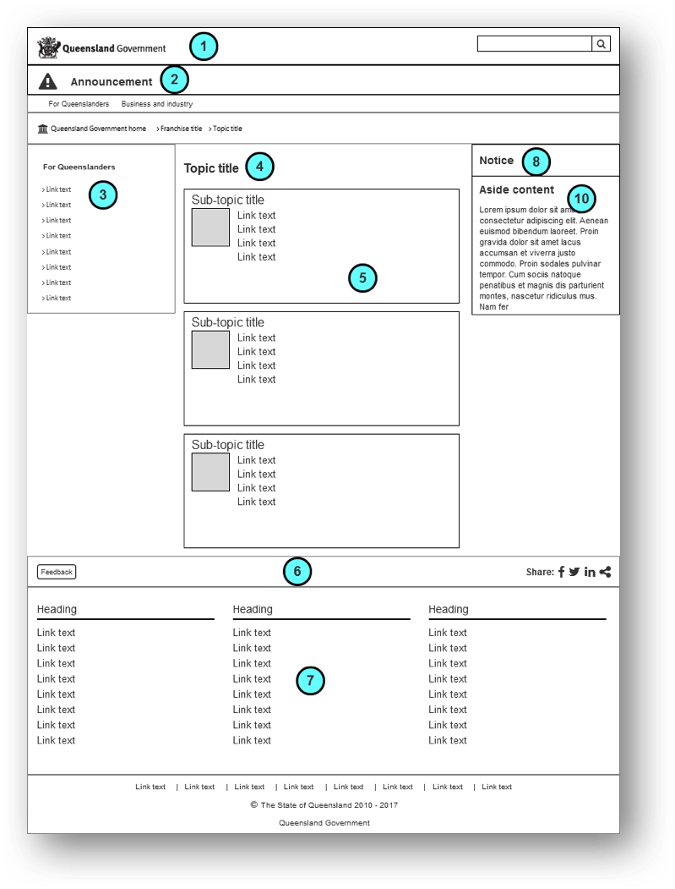

Topic page [Level 3]

Ref | Component | Presence | Location (page types) | Flexibility
--- | ------------- | ------------- | ------------- | -------------
11 | Section navigation | Required | Topic index, standard, guide, service, 2-column, news/events index, news content  | None. Can only contain one level of navigation under the section heading 

## 7.4	Content pages [Level 4]

Content pages (depending on page type) generally include 3 columns:
 *	left navigation column
 *	middle content column
 *	right ‘asides’ column.

Franchise websites can utilise different components to configure different content page types. They are:
 1.	Standard page
 2.	Guide page
 3.	Service pages (for online forms)
 4.	Silent node page
 5.	2-column and 1-column application page
 6.	News/events index pages
 7.	News content page.

### 7.4.1	Standard page

There are no specific component requirements for a standard content page. 
Refer to the global elements section for the components in the wireframe below.

Standard page [Level 4]

Ref | Component | Presence | Location (page types) | Flexibility
--- | ------------- | ------------- | ------------- | -------------
12 | Main content (e.g. text, images with captions, pull-quotes, tables, embedded video) | Required | Standard, guide, silent node, 2-column, 1-column application, news content | Listed ‘content types’ are supported. If new content types are required, please consult with Queensland Online.
13 | Cross-selling links. These are links to journeys that are not in the section navigation on this page (e.g. could be used as a ‘related links’ section). | Optional | Standard, guide, silent node | Between 1 and 5 links are supported. Consider style guide rules when creating. 
14 | Page last updated date | Required | Standard, guide, silent node, news content | None
15 | Page last reviewed date | Optional | Standard, guide, silent node, news content | None

### 7.4.2 Guide pages

Guide pages serve the same function as a standard page but are used for larger topics that require multiple pages to explain the content. They generally contain between 3 and 9 pages under a unifying article title. 

Guides feature a table of contents (tertiary navigation) and ‘next’ and ‘previous’ links that allow customers to progress through the different pages. 

Refer to the global elements section and table below for guide page components.

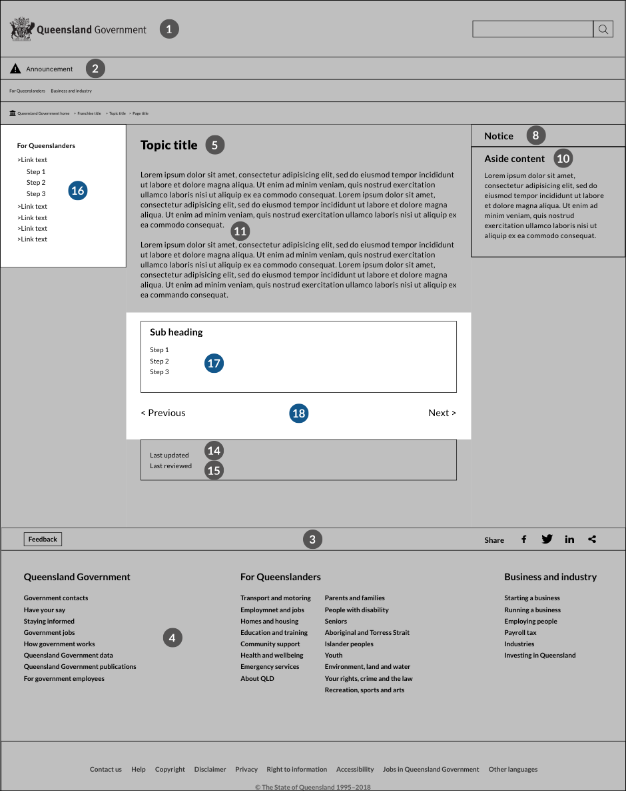

Guide page [Level 4]

Ref | Component | Presence | Flexibility
--- | ------------- | ------------- | -------------
16 | Process menu (appears in the section navigation of guide pages as a nested menu) | Required | None
17 | Table of contents | Required |
18 | Previous/next | Optional |

### 7.4.3	Service page (online forms)

Service pages are used for all integrated services, web applications and online forms. All online forms should be developed in HTML as it is the only format that meets the accessibility requirements (and will work on any device). Other formats can be provided to supplement the HTML form. 

Please refer to the [CUE Standard (Module 4: Online forms)](https://www.forgov.qld.gov.au/cue-module4-online-forms) for additional information. 

Refer to the global elements section and table below for service page components.

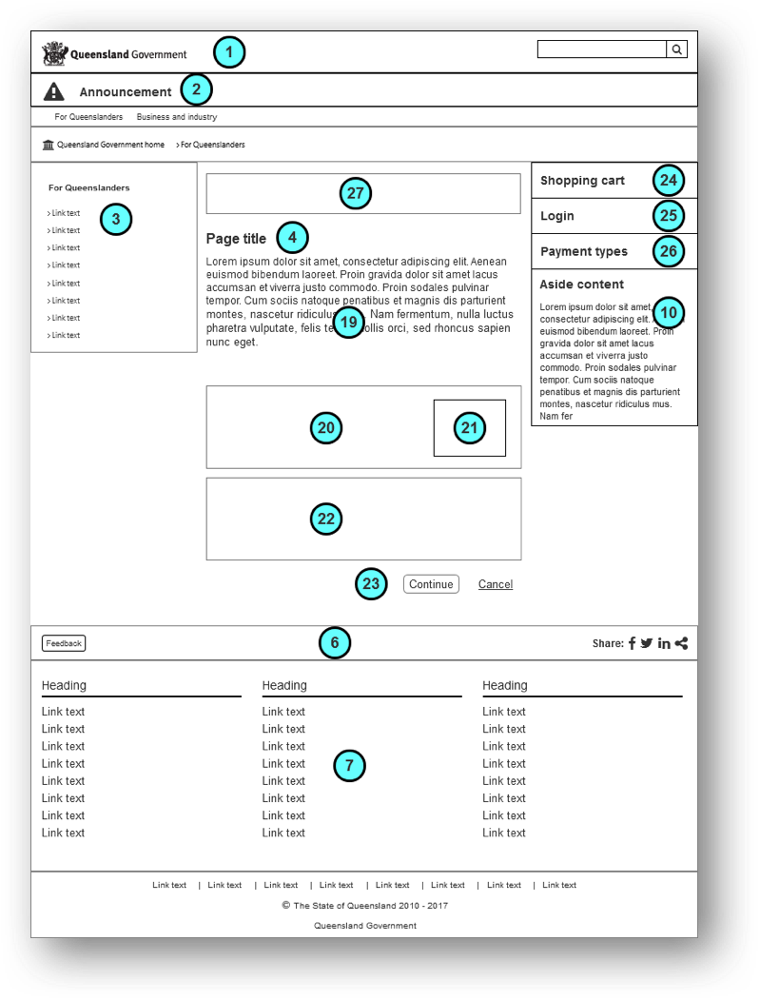

Service page [Level 4]

Ref | Component | Presence | Flexibility
--- | ------------- | ------------- | -------------
19 | Progress bar to communicate the current stage of a multistep process **NB:** this component is currently under construction. Therefore the location and presentation is yet to be finalised. * Until finalised, the component is optional. | Required* if a multistep form | Yet to be determined
20 | Introduction (to explain the purpose of the service—a ‘read more’ link can be used, if required.) | Required | None
21 | Error message summary block (will only appear if the form cannot be processed due to input or server-side errors) | Required | None
22 | Assistance popup or hints (will appear when it has been identified that the customer may need help) | Optional | Depends on audience requirements
23 | Form elements (refer to the pattern library on [GitHub](https://github.com/qld-gov-au/pattern-library/blob/master/source/patterns-for-web-forms.md) for details of different user interface elements) | Required | None. Before introducing new user interface elements, please consult with Queensland Online.
24 | Actions | Required | None
25 | Whole-of-government shopping cart | Required if service involves payments | None
26 | Login | Optional | Markup, presentation and behaviour **can be modified** depending on the type of account. Please consult with Queensland Online to discuss your requirements.
27 | Accepted payment types | Required if service involves payments | Appearance must be identical but location can be moved lower within asides column.

### 7.4.4 Silent node

A silent node is a ‘hidden’ content page in that it is not in the navigation or sitemap. It is a page that supports another page and is not relevant to other content. 

For example, silent nodes can be used for customer stories. Customer stories are initially ‘asides’ on a related content page. At the bottom of the aside, there is a link to 'read more' that takes you to a page with the complete article. The article is a silent node page. 

There are no specific component requirements for silent node pages. Refer to the global elements section for the components in the wireframe below.

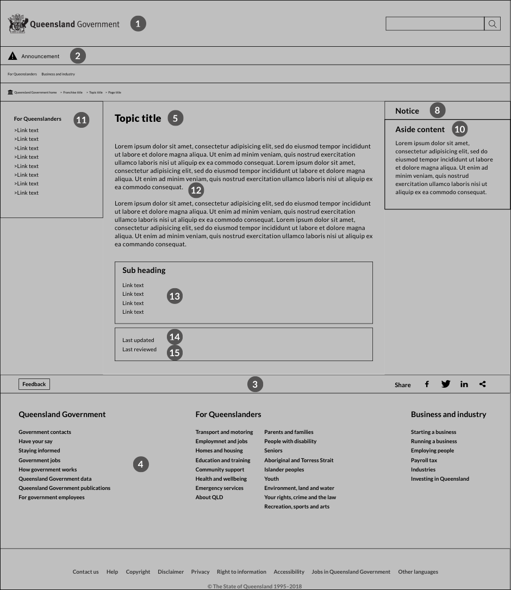

Silent node page [Level 4]

### 7.4.5	2-column or 1-column application page

A 2-column or 1-column application page can be used for specialised content that will not fit within a regular 3-column content page. However, agencies should minimise their use of this page format as they will need to consider how the wide column format displays on small and medium devices. 

There are no specific component requirements for these pages. Refer to the global elements section for the components in the wireframe below.

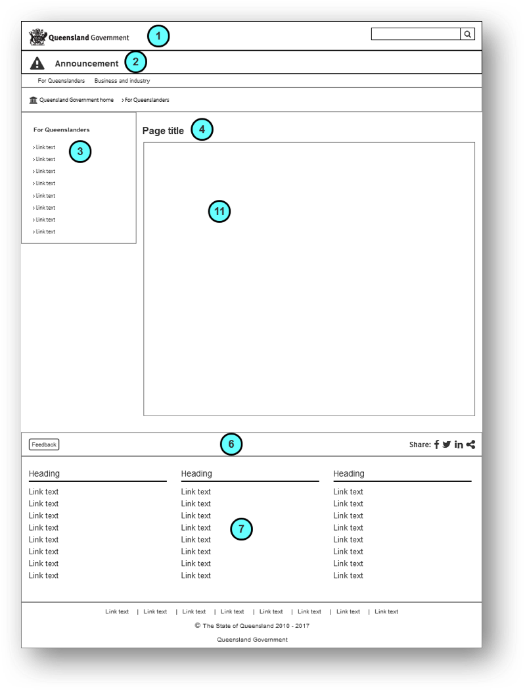

2-column application page

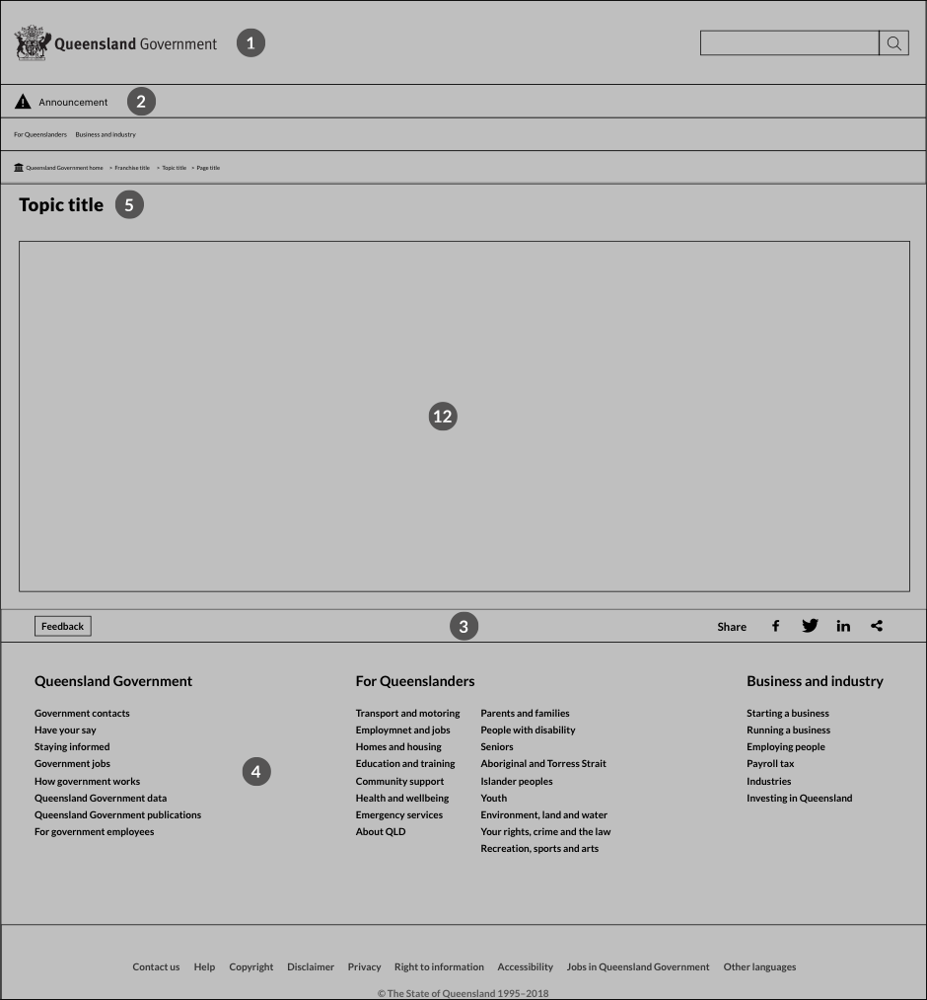

1-column application page

### 7.4.6	News or event index pages

News or event index pages are specially formulated to display a list of news articles or event listings. Refer to the global elements section and table below for news or event index page components.

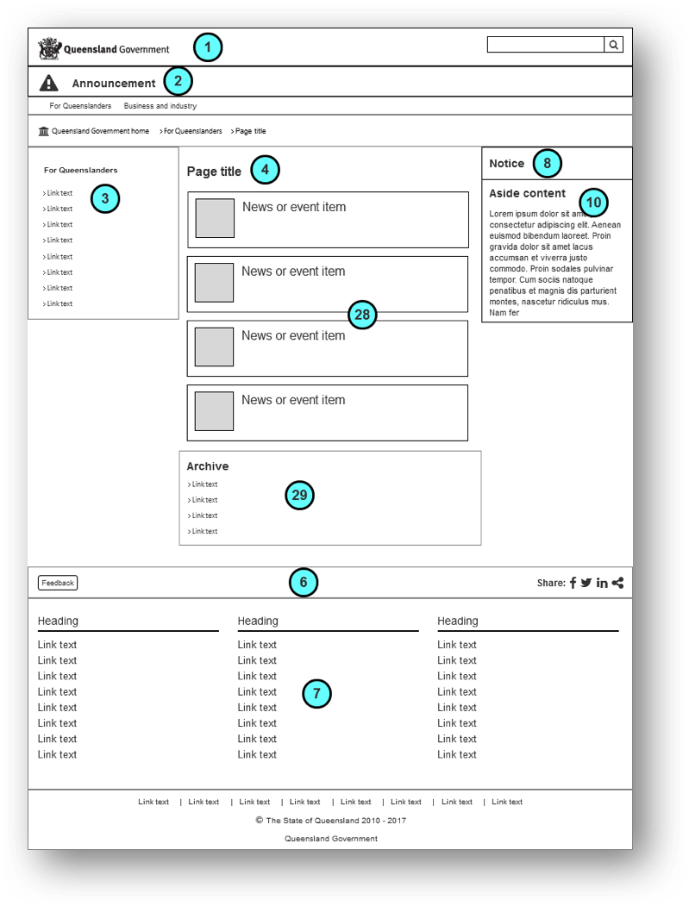

News or event index page

Ref | Component | Presence | Flexibility
--- | ------------- | ------------- | -------------
28 | Featured news or events items. Events should display in chronological order grouped by year and month. Events should be removed and moved to the archive list, after they have expired (recommend within one week) | Required | None. A maximum of 5+/- 2 news items featured.
29 | Links to archived items in reverse-chronological order grouped by year and month | Required | None

### 7.4.7	News content page

Refer to the global elements section and table below for news content page components.

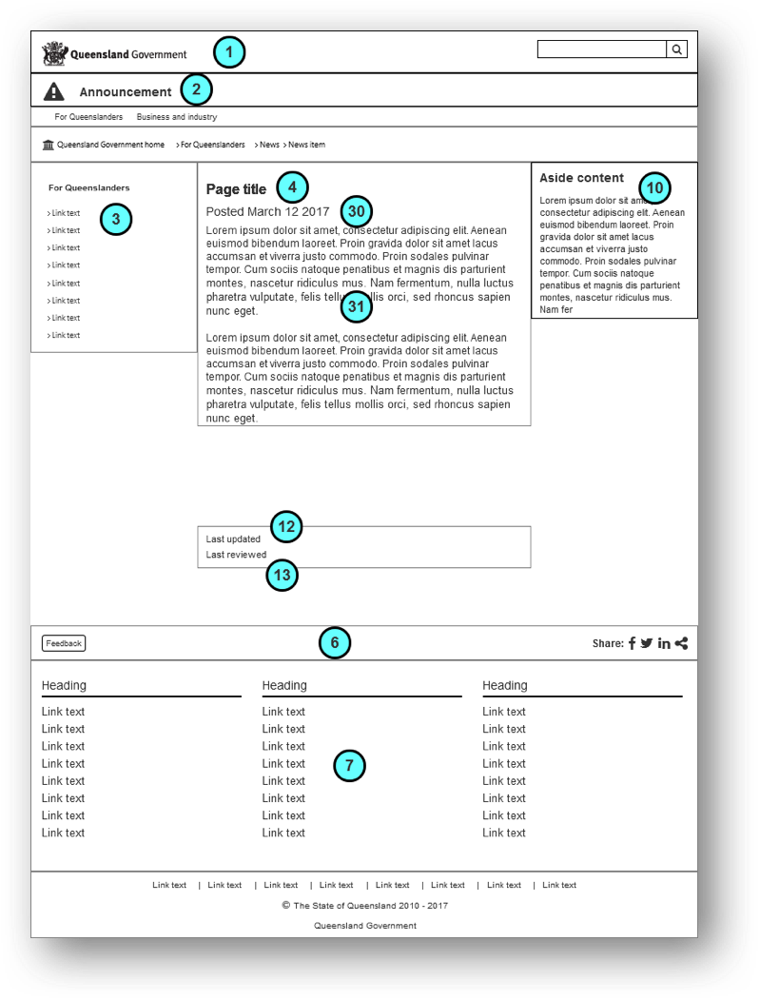

News content page

Ref | Component | Presence | Flexibility
--- | ------------- | ------------- | -------------
30 | Posted date for the news item | Required | None
31 | News article content | Required | None

# 7.5	Rich landing page 

The Rich landing page model can be used to: 
*	aggregate content by a topic or audience type – from within a franchise or across franchises – to meet an established customer need.
*	create more visually-driven landing page for promotional campaigns.

Note:
*	This page model isn't a replacement for a standard index page. This page model needs to appear in the information architecture and each section or 'card' takes you to a content page.
*	This page can be treated as a parent page with new child pages. These pagesthat are not mapped into the information architecture. 

Example: https://qld-gov-au.github.io/swe_template/pagemodels/aggregation.html 

Source: https://github.com/qld-gov-au/swe_template/blob/master/src/examples/aggregation.html

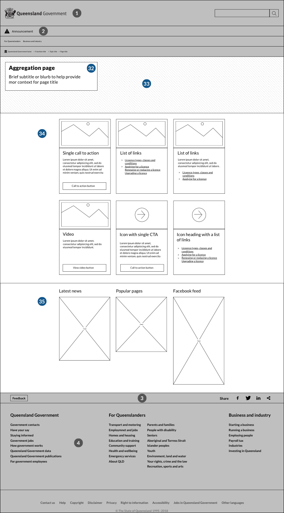

Rich landing page model

Ref | Component | Presence | Flexibility
--- | ------------- | ------------- | -------------
32 | Page title and subtitle | Required | Subtitle is optional
33 | Hero Image | Required | None
34 | Cards | Required | 1 - 6 cards
35 | Additional information panels  | Optional | Where information that would be in the aside goes 

**Implementation notes**

* Hero image (32)
	+ Image size: 1312 x 361 pixels. 
* Page title & subtitle (33)
	+ This should be descriptive of the purpose of the page (e.g. ‘Protecting the Great Barrier Reef’ is better than ‘Great Barrier Reef’ because it shows exactly what the page is about – and clarifies that it doesn’t include tourism etc. 
	+ A subtitle about the page is optional. It should only be used to further explain the page purpose, if necessary. 
	+ This subtitle **will appear in search results** so make sure that it adds extra information about the page that will help the user.
*	Cards
	+	Image size: 492 x 322 px
	+	A maximum of 6 cards is recommended for a comfortable scroll length on mobile devices.
	+	The cards will all be the same height on desktop but will reduce to the minimum size that fits their respective content when displayed on mobile
	+	Each card must have a thumbnail image or an embded video of the same dimensions. **Do not add a play icon** to your thumbnail image if the video is not going to play immediately. Embedded videos must have a full screen option available.
	+	Each card must have a heading.
	+	Each card can either have: Text with no links or button; Text with a call to action button; Intro text with 4 links. The fifth ‘more’ link (on other index pages) is not available for this model because sub-pages don’t exist in the model.
	+	Ensure that the heading, text/links, and button have different text and aren’t repetitive.
	+	The card size is constrained so the text will need to be succinct.
*	Additional information panels (35)
	+	These 3 panels are optional and should be used for additional information or things that might normally be put in an aside (the right-hand boxes). Social media (e.g. Facebook, Twitter, Instagram); Other pages (i.e. use them to display ‘Popular topics’ or other content like ‘About us’ or ‘Useful resources’.); News (i.e. a news story summary in each panel);	A mix of the above – 1 social media panel, 1 panel listing news item links, 1 panel listing popular pages.
*	Navigation elements
	+	The page needs to include breadcrumbs.

**Register page of page model**

Register page model use at https://www.forgov.qld.gov.au/forum/topic/16001-aggregation-page-register 

**7.5	Advanced franchise landing page [Level 2]**

The advanced franchise landing page helps customers browse and navigate to promoted content in the section with a specific focus on campaign content. The child page links, in this instance headings only, are the only manadatory component of this page. All other elements are optional and can be displayed in any order a franchise determines suitable. 

Refer to the global elements section and table below for franchise landing page components.

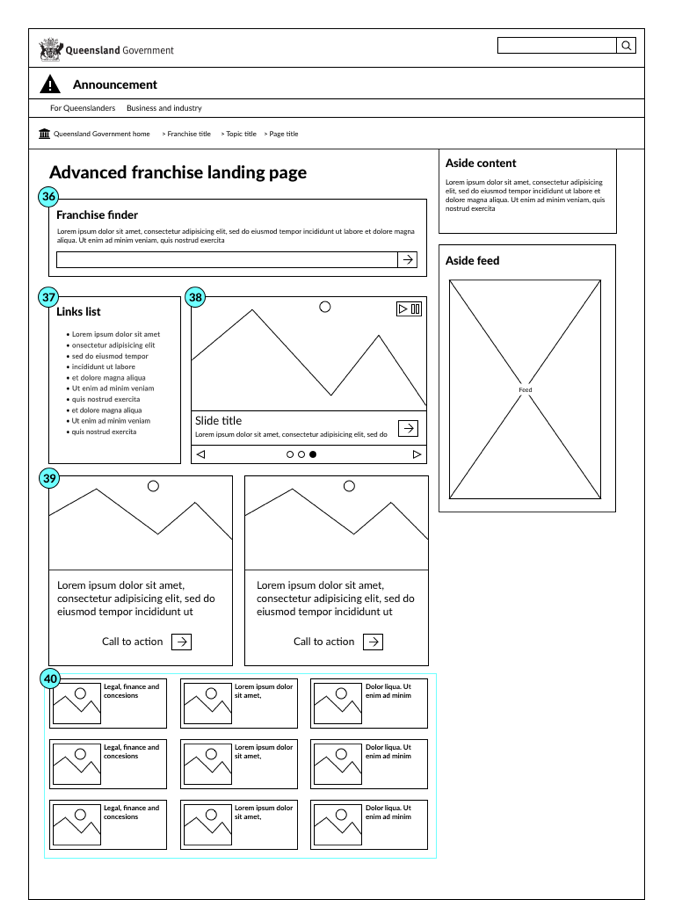

Advanced franchise landing pagee

Ref | Component | Presence | Flexibility
--- | ------------- | ------------- | -------------
36 | Franchise finder  | Optional | Can be moved
37 | Links list  | Optional | Can be moved
38 | Promotional carousel | Optional | Can be moved
39 | Promotional feature | Optional | Can be moved
40 | Franchise index | Required | Can be moved

**Implementation notes**

* Franchise finder
	+ This search is limited to the subject area within the franchise
* Service list
	+ This is a list of high value links to items within the subject area
* Promotional carousel
	+ This is a carousel that contains up to 5 slides
	+ Slide image dimensions: 600 x 373 px
	+ This carousel must have play or pause controls to meet our accessibility obligations.
*	Promotional feature
	+ Feature image dimensions: 444 x 275 px
*	Franchise index 
	+ Thumbnail image dimensions: 75 x 75 px

**Future use of the page model**

* The User interface (UI CoP) will review the page model’s use in January 2018 and discuss proposed changes. 
	+	Changes agreed by the group will be made to the template and these instructions. 
	+	Urgent changes can be made before then but a review of suggestions and non-urgent changes will be done in early 2018.) 
* The UI CoP will review the page model and the register on an ongoing basis to ensure that page models with an end date (i.e. tied to short-term campaigns) are decommissioned.

## 7.6	Continuious improvement of the page model

The User interface Community of Practice (UI CoP) will review all page model’s use and discuss proposed changes. 

*	The UI CoP will review the page model and the register on an ongoing basis to ensure that page models with an end date (i.e. tied to short-term campaigns) are decommissioned.

*	The Franchise Management Group will approve proposed changes to this page model. 

# 8.0 Additional components

## 8.1	News/feature item

*	Appears in the main content panel or in the right-hand panel, as an aside
*	Heading less than 33 characters (including spaces)
*	Body text between 20 and 40 words
*	Link to the full story 
*	Image …

Please refer to the [SWE 3 call out box](https://qld-gov-au.github.io/web-template-release/components.html#call-out-box) for an example of this component.

## 8.2 Break-out box

*	Draws the audience’s attention to a key message 
*	Contains all of the information (rather than linking off to another page for more details) 
*	Heading less than 33 characters (including spaces) 
*	Body text less than 100 words

Please refer to the [SWE 3 call out box](https://qld-gov-au.github.io/web-template-release/components.html#call-out-box) for an example of this component.

## 8.3 Grab/standfirst paragraph 

*	Also draws the audience’s attention to a key message
*	Between 10 and 30 words
*	There can be multiple ‘grabs’ on a single page 

Please refer to the [SWE 3 call out box](https://qld-gov-au.github.io/web-template-release/components.html#call-out-box) for an example of this component.

## 8.4 Testimonial 

*	Heading—person’s first name and suburb (e.g. Bill, Toowong)
*	Body less than 70 words (the shorter, the better)

Please refer to the [SWE 3 call out box](https://qld-gov-au.github.io/web-template-release/components.html#call-out-box) for an example of this component.

## 8.5	Pull quote 

*	Need to grab the reader and entice them to read more 
*	Should be short (less than 20 words)
*	Contains quotation marks
*	Must be from page content

Please refer to the [SWE 3 call out box](https://qld-gov-au.github.io/web-template-release/components.html#call-out-box) for an example of this component.

# 9.0 Photographic images 

## 9.1	Image optimisation

*	Crop images to the appropriate size that will be used on the site. Some images can be resized if research indicates that it would benefit the audience. For example, the road signs on the [Transport and Motoring franchise](https://www.qld.gov.au/transport/conditions/disasters/signs) are resized so the proportions are the same as the actual signs.
*	Preserve the aspect ratio—don’t stretch or squeeze the image.
*	At onscreen resolution, is the subject of the image clear?
*	Save as a jpg or png.
*	Don’t mirror (flip) images for aesthetic reasons.
*	For naming convention guidelines, refer to the URL and filename design guidelines section.

## 9.2	Suitability

Images must be relevant to the content and where practical, taken in Queensland. Consider the following:

*	Is the steering wheel on the correct side of the car?
*	Are things like street signs, service uniforms or clothing correct for Queensland?
*	Are landmarks relevant to the content? For example, don’t use a photo of a South East Queensland river on a page about North Queensland.
*	Are there any cultural awareness issues regarding the subject matter of the photo?
*	If the picture shows people working, does it include the appropriate personal protective equipment to comply with health and safety laws?
*	Does the photo contain number plates or other personally identifying details?
*	How is the image being used? For example, don’t create false banners (an image that fits the width of the content column before Heading 1) or false bottoms (an image that, through its width and placement on the page, implies the end of an article). 
*	Does the image look professional and appropriate (e.g. avoid clipart)?
*	Has consent been obtained and recorded for all of the people in the image? 

## 9.3	Caption (for non-decorative images or photos) 

*	Should be sentence case and have no closing punctuation. 
*	Only requires ‘alt text’ if the caption doesn’t convey some specific detail apparent to sighted users. 

Please refer to the [SWE 3 Images & Figures](https://qld-gov-au.github.io/web-template-release/styles.html#images ) for an example of this component.

## 9.4	Sourcing images
All images should be:

*	owned by the Queensland Government
*	in the public domain or
*	suitably licenced (check for a Creative Commons licence). 

Main image sourcing considerations: 
*	Is the image royalty free?
*	Has credit been given if necessary? See the section on image credits for more detail.
*	Is there a signed consent (release) form from everyone in the photo? 

## 9.5 Image credits

Use the appropriate style from the list below. Note: there is no closing punctuation.

**Examples**

© Tourism Queensland
© Brisbane Marketing. Photo by P. Topler
© iStockphoto.com. Photo by Michael Phillips
© Ray Cash Photography
© Sarah Elliott

Please refer to the [SWE 3 Images & Figures](https://qld-gov-au.github.io/web-template-release/styles.html#images ) for an example of this component.

### 9.5.1 External non-commissioned images

If an image is supplied free by an external agency or individual, they need to provide the copyright information.

### 9.5.2 Queensland Government images

If an image is taken by a Queensland Government employee (in the course of their work) or a freelance photographer commissioned by a government agency, copyright belongs to the State of Queensland and the statement in the website footer is sufficient. The photographer is not credited in this instance. 

## 9.6 Image types

### 9.6.1 Index page thumbnail

Thumbnails appear on franchise landing and topic index pages—for example, [Health and wellbeing](https://www.qld.gov.au/health) (franchise) or [Screening and health checks](https://www.qld.gov.au/health/conditions/screening) (topic).

Index page thumbnails have the following specifications: 

*	Alt text and caption—no
*	Moral rights—no
*	The image must not be reused on the same page
*	Dimensions—75 x 75 pixels

Please refer to the [SWE 3 Index Page Template](https://qld-gov-au.github.io/web-template-release/pagemodels/index-page.html) for an example of this component.

### 9.6.2 Wide angle aside

Wide angle aside images have the following specifications:

*	Alt text and caption—yes
*	Moral rights—only if taken by someone not working for the Queensland Government
*	Dimensions—284 x 113 pixels (**recommended**)

*	Dimensions—284 x 159 pixels (**alternative**; only to be used if the recommended dimensions distort the source photo)

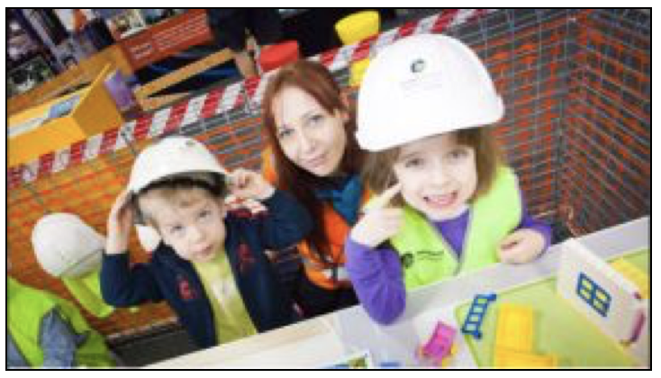

### 9.6.3 Photo gallery thumbnail

Photo gallery thumbnails have the following specifications:

*	Alt text and caption—no
*	Moral rights—no
*	Dimensions—100 x 100 pixels

### 9.6.4 Photo gallery light-box image

Photo gallery light-box images have the following specifications:

*	Alt text and caption—yes
*	Moral rights—only if taken by someone not working for the Queensland Government
*	Dimensions:
	*	Minimum—the longest side should be at least 600 pixels
	*	Maximum—1680 x 1050 pixels

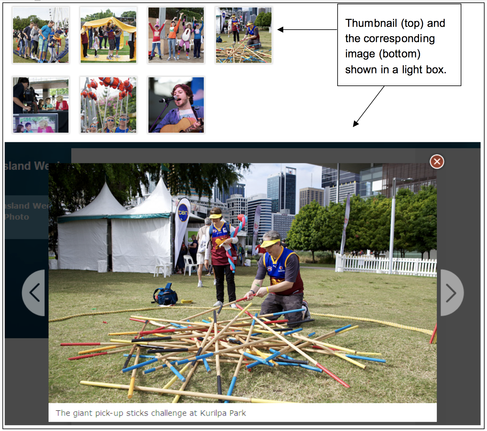

An example will be added to the [SWE 3 models and templates](https://qld-gov-au.github.io/web-template-release/index.html) soon.

### 9.6.5 Cut-in image (landscape)

*	Alt text and caption—yes
*	Moral rights—only if taken by someone not working for the Queensland Government
*	Dimensions—374 x 187

Please refer to the [SWE 3 Images & Figures](https://qld-gov-au.github.io/web-template-release/styles.html#images ) for an example of this component.

### 9.6.6 Cut-in image (portrait)

*	Alt text and caption—yes
*	Moral rights—only if taken by someone not working for the Queensland Government
*	Dimensions—284 x 379

Please refer to the [SWE 3 Images & Figures](https://qld-gov-au.github.io/web-template-release/styles.html#images ) for an example of this component.

### 9.6.7	Diagrams and figures
Diagrams and figures require different formatting to other images. Please refer to the [Pattern Library](https://github.com/qld-gov-au/pattern-library/blob/master/source/content-types/content-patterns/content-patterns.md#figures-images-diagrams-captions) for more information.

# 10	Homepage components

## 10.1 Hero feature image

These are the full-screen feature images on www.qld.gov.au. 

*	Alt text—yes
*	Moral rights—only if taken by someone not working for the Queensland Government
*	Dimensions—1905 x 574

## 10.2	Initiatives feature image

An initiatives feature is one of the smaller images on www.qld.gov.au.

*	Alt text—yes
*	Moral rights—only if taken by someone not working for the Queensland Government
*	Dimensions—291 x 197

## 10.3	News feature image

Agencies may submit news/features for consideration on the homepage at the link below:

https://www.forgov.qld.gov.au/request-web-feature-queensland-government

# 11	Metadata

Queensland Government websites use metadata to: 

*	Improve search engine optimisation rankings
*	Group and display similar content (i.e. adding a specific metadata tag to an event or news item can trigger the item to appear on content pages with the same tag) 
